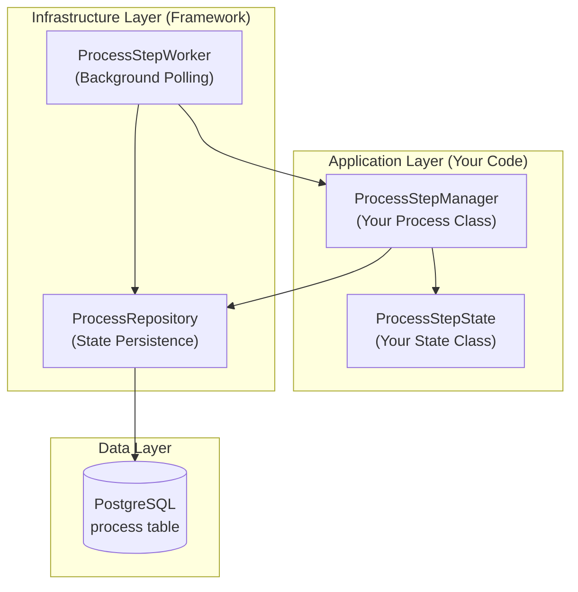
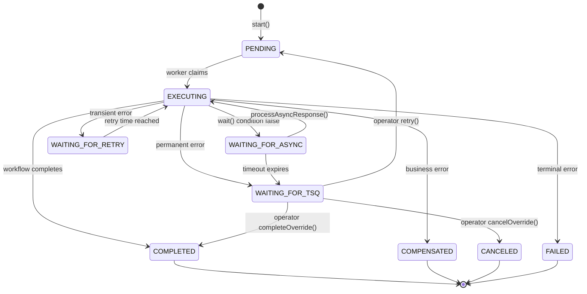
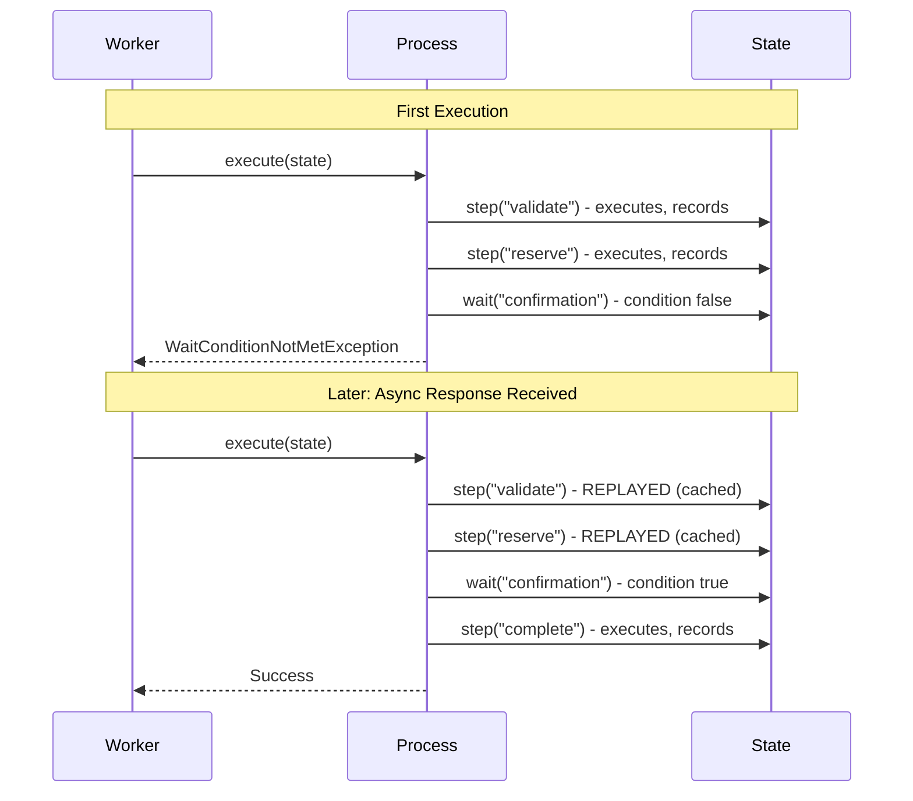
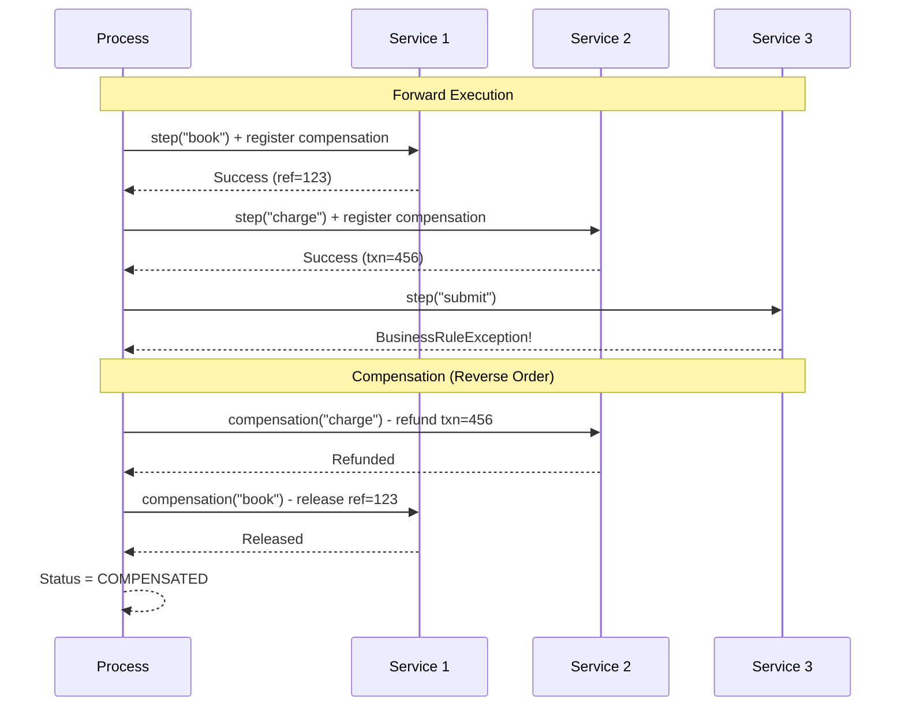

# Step-Based Process Developer Guide

A comprehensive guide to building reliable, long-running workflows using the ProcessStepManager framework.

## Table of Contents

1. [Introduction](#1-introduction)
2. [Core Concepts](#2-core-concepts)
3. [Getting Started](#3-getting-started)
4. [Step Execution Deep Dive](#4-step-execution-deep-dive)
5. [Wait Conditions & Async Responses](#5-wait-conditions--async-responses)
6. [Side Effects](#6-side-effects)
7. [Exception Handling & Retry](#7-exception-handling--retry)
8. [Troubleshooting Queue (TSQ)](#8-troubleshooting-queue-tsq)
9. [Process Deadlines](#9-process-deadlines)
10. [ProcessStepWorker Configuration](#10-processstepworker-configuration)
11. [Advanced: PaymentStepProcess Reference](#11-advanced-paymentstepprocess-reference)
12. [Testing Strategies](#12-testing-strategies)
13. [Best Practices](#13-best-practices)
14. [Quick Reference](#14-quick-reference)

---

## 1. Introduction

### What is Step-Based Processing?

Step-based processing is a workflow orchestration pattern inspired by [Temporal.io](https://temporal.io/) that enables you to write long-running business processes as simple, sequential code while the framework handles:

- **Durability**: Process state survives crashes and restarts
- **Deterministic Replay**: Failed processes resume exactly where they left off
- **Compensation (Saga Pattern)**: Automatic rollback on business failures
- **Async Response Handling**: Processes can wait for external events
- **Retry with Backoff**: Transient failures retry automatically
- **Troubleshooting Queue**: Permanent failures queue for operator intervention

### When to Use Step-Based Processing

Use `ProcessStepManager` when your workflow has:

| Characteristic | Example |
|---------------|---------|
| Multiple sequential steps | Validate → Reserve → Charge → Fulfill |
| External async responses | Wait for payment gateway callback |
| Compensation requirements | Release reservation if payment fails |
| Long execution time | Minutes to hours to complete |
| Crash recovery needs | Must resume after server restart |

### Step-Based vs Command-Based

This framework offers two execution models:

| Aspect | Step-Based (ProcessStepManager) | Command-Based (BaseProcessManager) |
|--------|--------------------------------|-----------------------------------|
| **Paradigm** | Sequential code with `step()` and `wait()` | State machine with explicit transitions |
| **Async Handling** | `wait()` pauses execution | PGMQ message replies |
| **Best For** | Complex workflows, saga patterns | Simple request-response, event-driven |

This guide focuses exclusively on **step-based processing**.

---

## 2. Core Concepts

### 2.1 Architecture Overview

The framework consists of four main components:



**ASCII Alternative:**
```
┌─────────────────────────────────────────────────────────────┐
│                    APPLICATION LAYER                         │
│  ┌─────────────────────┐    ┌─────────────────────┐        │
│  │ ProcessStepManager  │───▶│  ProcessStepState   │        │
│  │   (Your Process)    │    │   (Your State)      │        │
│  └──────────┬──────────┘    └─────────────────────┘        │
└─────────────┼───────────────────────────────────────────────┘
              │
┌─────────────┼───────────────────────────────────────────────┐
│             ▼           INFRASTRUCTURE LAYER                 │
│  ┌─────────────────────┐    ┌─────────────────────┐        │
│  │ ProcessStepWorker   │───▶│  ProcessRepository  │        │
│  │   (Polling/Resume)  │    │   (Persistence)     │        │
│  └─────────────────────┘    └──────────┬──────────┘        │
│                                        │                    │
│                              ┌─────────▼─────────┐         │
│                              │    PostgreSQL     │         │
│                              │  (process table)  │         │
│                              └───────────────────┘         │
└─────────────────────────────────────────────────────────────┘
```

| Component | Responsibility |
|-----------|---------------|
| **ProcessStepManager** | Base class you extend; provides `step()`, `wait()`, `sideEffect()` |
| **ProcessStepState** | Base class for your state; tracks step history, wait history, side effects |
| **ProcessStepWorker** | Background service that polls for pending processes and retries |
| **ProcessRepository** | Persists process state to PostgreSQL |

### 2.2 Process Lifecycle

Every process moves through a defined set of states:



**State Transition Table:**

| From State | Trigger | To State |
|------------|---------|----------|
| `PENDING` | Worker claims process | `EXECUTING` |
| `EXECUTING` | Workflow completes successfully | `COMPLETED` |
| `EXECUTING` | `wait()` condition returns false | `WAITING_FOR_ASYNC` |
| `EXECUTING` | Transient error with retries remaining | `WAITING_FOR_RETRY` |
| `EXECUTING` | Business rule violation | `COMPENSATED` |
| `EXECUTING` | Permanent error | `WAITING_FOR_TSQ` |
| `WAITING_FOR_ASYNC` | `processAsyncResponse()` called | `EXECUTING` |
| `WAITING_FOR_ASYNC` | Wait timeout expires | `WAITING_FOR_TSQ` |
| `WAITING_FOR_RETRY` | Scheduled retry time reached | `EXECUTING` |
| `WAITING_FOR_TSQ` | Operator calls `retry()` | `PENDING` |
| `WAITING_FOR_TSQ` | Operator calls `cancelOverride()` | `CANCELED` |
| `WAITING_FOR_TSQ` | Operator calls `completeOverride()` | `COMPLETED` |

### 2.3 Deterministic Replay

The key innovation of step-based processing is **deterministic replay**. When a process resumes after a pause or crash:

1. The framework calls your `execute()` method from the beginning
2. Each `step()` call checks if it already completed
3. Completed steps return their cached result without re-executing
4. Execution continues from where it left off



**Why This Matters:**

- **Crash Recovery**: Server restarts don't lose progress
- **Idempotency**: Steps only execute once, even on retry
- **Debugging**: Full execution history is preserved
- **Compensation**: Framework knows which steps to roll back

---

## 3. Getting Started

This section walks through creating a simple order processing workflow.

### 3.1 Define Your State Class

Your state class holds all data your workflow needs. It must extend `ProcessStepState`:

```java
package com.example.order;

import com.ivamare.commandbus.process.step.ProcessStepState;
import java.math.BigDecimal;
import java.time.Instant;
import java.util.UUID;

/**
 * State for order processing workflow.
 *
 * Framework-managed fields (inherited):
 * - stepHistory: Records of each step execution
 * - waitHistory: Records of wait conditions
 * - sideEffects: Cached non-deterministic values
 * - errorCode/errorMessage: Last error details
 * - processDeadline: Optional deadline for entire process
 */
public class OrderState extends ProcessStepState {

    // ========== Domain Fields ==========

    private UUID orderId;
    private String customerId;
    private BigDecimal totalAmount;
    private String currency;

    // Step results
    private String validationResult;
    private String reservationId;
    private String paymentTransactionId;
    private Instant fulfilledAt;

    // ========== Constructors ==========

    public OrderState() {
        // Required for Jackson deserialization
    }

    public OrderState(UUID orderId, String customerId,
                      BigDecimal totalAmount, String currency) {
        this.orderId = orderId;
        this.customerId = customerId;
        this.totalAmount = totalAmount;
        this.currency = currency;
    }

    // ========== Wait Condition Helpers ==========

    /**
     * Check if order has been fulfilled (for wait condition).
     */
    public boolean isFulfilled() {
        return fulfilledAt != null;
    }

    // ========== Getters and Setters ==========

    public UUID getOrderId() { return orderId; }
    public void setOrderId(UUID orderId) { this.orderId = orderId; }

    public String getCustomerId() { return customerId; }
    public void setCustomerId(String customerId) { this.customerId = customerId; }

    public BigDecimal getTotalAmount() { return totalAmount; }
    public void setTotalAmount(BigDecimal totalAmount) { this.totalAmount = totalAmount; }

    public String getCurrency() { return currency; }
    public void setCurrency(String currency) { this.currency = currency; }

    public String getValidationResult() { return validationResult; }
    public void setValidationResult(String validationResult) {
        this.validationResult = validationResult;
    }

    public String getReservationId() { return reservationId; }
    public void setReservationId(String reservationId) {
        this.reservationId = reservationId;
    }

    public String getPaymentTransactionId() { return paymentTransactionId; }
    public void setPaymentTransactionId(String paymentTransactionId) {
        this.paymentTransactionId = paymentTransactionId;
    }

    public Instant getFulfilledAt() { return fulfilledAt; }
    public void setFulfilledAt(Instant fulfilledAt) {
        this.fulfilledAt = fulfilledAt;
    }
}
```

### 3.2 Define Your Process Class

Your process class contains the workflow logic. Extend `ProcessStepManager`:

```java
package com.example.order;

import com.ivamare.commandbus.process.ProcessRepository;
import com.ivamare.commandbus.process.step.ProcessStepManager;
import com.ivamare.commandbus.process.step.StepOptions;
import com.ivamare.commandbus.process.step.exceptions.StepBusinessRuleException;
import org.springframework.jdbc.core.JdbcTemplate;
import org.springframework.transaction.support.TransactionTemplate;

import java.time.Duration;

public class OrderProcess extends ProcessStepManager<OrderState> {

    private final OrderService orderService;
    private final InventoryService inventoryService;
    private final PaymentService paymentService;

    public OrderProcess(
            ProcessRepository processRepo,
            JdbcTemplate jdbcTemplate,
            TransactionTemplate transactionTemplate,
            OrderService orderService,
            InventoryService inventoryService,
            PaymentService paymentService) {
        super(processRepo, jdbcTemplate, transactionTemplate);
        this.orderService = orderService;
        this.inventoryService = inventoryService;
        this.paymentService = paymentService;
    }

    // ========== Required Abstract Methods ==========

    @Override
    public String getProcessType() {
        return "ORDER_PROCESS";  // Unique identifier for this process type
    }

    @Override
    public String getDomain() {
        return "orders";  // Domain/namespace for this process
    }

    @Override
    public Class<OrderState> getStateClass() {
        return OrderState.class;  // For Jackson deserialization
    }

    // ========== Workflow Definition ==========

    @Override
    protected void execute(OrderState state) {

        // Step 1: Validate order
        // Simple step with no retries or compensation
        step("validateOrder", StepOptions.<OrderState, String>builder()
            .action(this::validateOrder)
            .build());

        // Step 2: Reserve inventory (with compensation)
        // If later steps fail, release the reservation
        step("reserveInventory", StepOptions.<OrderState, String>builder()
            .action(this::reserveInventory)
            .maxRetries(3)
            .retryDelay(Duration.ofSeconds(2))
            .compensation(this::releaseInventory)
            .build());

        // Step 3: Process payment (with compensation)
        step("processPayment", StepOptions.<OrderState, String>builder()
            .action(this::processPayment)
            .maxRetries(3)
            .retryDelay(Duration.ofSeconds(5))
            .compensation(this::refundPayment)
            .build());

        // Step 4: Wait for fulfillment confirmation
        // Process pauses here until external system confirms
        wait("awaitFulfillment", state::isFulfilled, Duration.ofHours(24));

        // Step 5: Complete order
        step("completeOrder", StepOptions.<OrderState, Void>builder()
            .action(this::completeOrder)
            .build());
    }

    // ========== Step Implementations ==========

    private String validateOrder(OrderState state) {
        String result = orderService.validate(state.getOrderId());

        if ("INVALID".equals(result)) {
            // Business rule violation triggers compensation
            throw new StepBusinessRuleException(
                "Order validation failed for " + state.getOrderId());
        }

        state.setValidationResult(result);
        return result;
    }

    private String reserveInventory(OrderState state) {
        String reservationId = inventoryService.reserve(
            state.getOrderId(),
            state.getTotalAmount()
        );
        state.setReservationId(reservationId);
        return reservationId;
    }

    private void releaseInventory(OrderState state) {
        // Compensation: called if payment fails
        if (state.getReservationId() != null) {
            inventoryService.release(state.getReservationId());
        }
    }

    private String processPayment(OrderState state) {
        String transactionId = paymentService.charge(
            state.getCustomerId(),
            state.getTotalAmount(),
            state.getCurrency()
        );
        state.setPaymentTransactionId(transactionId);
        return transactionId;
    }

    private void refundPayment(OrderState state) {
        // Compensation: called if fulfillment times out
        if (state.getPaymentTransactionId() != null) {
            paymentService.refund(state.getPaymentTransactionId());
        }
    }

    private Void completeOrder(OrderState state) {
        orderService.markComplete(state.getOrderId());
        return null;
    }
}
```

### 3.3 Start a Process

```java
// Create initial state
OrderState state = new OrderState(
    UUID.randomUUID(),
    "CUST-123",
    new BigDecimal("99.99"),
    "USD"
);

// Start the process
UUID processId = orderProcess.start(state);

// Process executes until it hits wait("awaitFulfillment")
// Status is now WAITING_FOR_ASYNC
```

### 3.4 Handle Async Response

When the fulfillment system confirms the order:

```java
// External system calls your API endpoint
public void onFulfillmentConfirmed(UUID processId) {
    orderProcess.processAsyncResponse(processId, state -> {
        state.setFulfilledAt(Instant.now());
    });
    // Process automatically resumes and completes
}
```

### 3.5 Spring Configuration

Register your process as a Spring bean:

```java
@Configuration
public class OrderProcessConfig {

    @Bean
    public OrderProcess orderProcess(
            ProcessRepository processRepository,
            JdbcTemplate jdbcTemplate,
            TransactionTemplate transactionTemplate,
            OrderService orderService,
            InventoryService inventoryService,
            PaymentService paymentService) {
        return new OrderProcess(
            processRepository,
            jdbcTemplate,
            transactionTemplate,
            orderService,
            inventoryService,
            paymentService
        );
    }

    @Bean
    public ProcessStepWorker processStepWorker(
            OrderProcess orderProcess,
            ProcessRepository processRepository) {
        return new ProcessStepWorker(
            List.of(orderProcess),
            processRepository
        );
    }
}
```

---

## 4. Step Execution Deep Dive

### 4.1 Basic Steps

The simplest form of step execution:

```java
// Minimal step - just an action
String result = step("myStep", state -> {
    return someService.doSomething(state.getData());
});

// Step with max retries
String result = step("myStep",
    state -> someService.doSomething(state.getData()),
    3  // maxRetries
);

// Step with retries and compensation
String result = step("myStep",
    state -> someService.doSomething(state.getData()),
    3,  // maxRetries
    state -> someService.undoSomething(state.getData())  // compensation
);
```

**Step Naming Best Practices:**

| Do | Don't |
|-----|-------|
| `validateOrder` | `step1` |
| `reserveInventory` | `reserve` |
| `processPayment` | `pay` |
| `awaitL1Confirmation` | `wait` |

Step names must be unique within a process and are used for:
- Replay detection
- Audit logging
- Error reporting
- Compensation mapping

### 4.2 StepOptions Builder

For full control, use the builder pattern:

```java
step("complexStep", StepOptions.<MyState, String>builder()

    // Required: The action to execute
    .action(state -> myService.process(state))

    // Retry configuration
    .maxRetries(3)                        // Total attempts (default: 1)
    .retryDelay(Duration.ofSeconds(5))    // Base delay (default: 1s)

    // Timeout
    .timeout(Duration.ofSeconds(30))      // Step timeout (default: 30s)

    // Compensation for saga rollback
    .compensation(state -> myService.rollback(state))

    // Rate limiting (requires Bucket4jRateLimiter configured)
    .rateLimitKey("my-api")               // Rate limit resource key
    .rateLimitTimeout(Duration.ofSeconds(10))  // Max wait for token

    .build()
);
```

**Configuration Options Reference:**

| Option | Type | Default | Description |
|--------|------|---------|-------------|
| `action` | `Function<TState, R>` | Required | The step logic to execute |
| `maxRetries` | `int` | 1 | Total attempts allowed (1 = no retry) |
| `retryDelay` | `Duration` | 1 second | Base delay between retries |
| `timeout` | `Duration` | 30 seconds | Max execution time per attempt |
| `compensation` | `Consumer<TState>` | null | Saga rollback action |
| `rateLimitKey` | `String` | null | Distributed rate limit bucket key |
| `rateLimitTimeout` | `Duration` | 5 seconds | Max wait for rate limit token |

### 4.3 Compensation Pattern (Saga)

Compensations implement the Saga pattern for distributed transactions:



**How Compensations Work:**

1. **Registration**: When a step with `.compensation()` succeeds, the compensation is registered
2. **Trigger**: A `StepBusinessRuleException` triggers compensation
3. **Order**: Compensations run in **reverse order** of successful steps
4. **Best Effort**: If a compensation fails, the framework logs and continues with remaining compensations

**Example with Multiple Compensations:**

```java
@Override
protected void execute(OrderState state) {
    // Each successful step registers its compensation

    step("reserveInventory", StepOptions.<OrderState, String>builder()
        .action(this::reserveInventory)
        .compensation(this::releaseInventory)  // Comp #1
        .build());

    step("reserveShipping", StepOptions.<OrderState, String>builder()
        .action(this::reserveShipping)
        .compensation(this::cancelShipping)    // Comp #2
        .build());

    step("chargePayment", StepOptions.<OrderState, String>builder()
        .action(this::chargePayment)
        .compensation(this::refundPayment)     // Comp #3
        .build());

    step("notifyWarehouse", StepOptions.<OrderState, Void>builder()
        .action(this::notifyWarehouse)
        .build());  // This throws StepBusinessRuleException

    // If notifyWarehouse fails with business error:
    // 1. refundPayment() runs (Comp #3)
    // 2. cancelShipping() runs (Comp #2)
    // 3. releaseInventory() runs (Comp #1)
    // 4. Process status → COMPENSATED
}
```

**Compensation Best Practices:**

| Practice | Why |
|----------|-----|
| Make compensations idempotent | May run multiple times on crashes |
| Check for null references | Step may have failed before recording state |
| Log compensation actions | Aids debugging and audit |
| Don't throw exceptions | Framework catches but continues |

---

## 5. Wait Conditions & Async Responses

### 5.1 Wait Mechanics

The `wait()` method pauses process execution until a condition is met:

```java
// Basic wait with default timeout (1 hour)
wait("awaitConfirmation", () -> state.isConfirmed());

// Wait with custom timeout
wait("awaitPayment",
    () -> state.getPaymentReceivedAt() != null,
    Duration.ofMinutes(30)
);

// Wait using state method reference
wait("awaitFulfillment", state::isFulfilled, Duration.ofHours(24));
```

**Wait Execution Flow:**

```
┌─────────────────────────────────────────────────────────────────┐
│                        wait() Called                             │
└─────────────────────────────────────────────────────────────────┘
                              │
                              ▼
                    ┌─────────────────┐
                    │ Check if already│
                    │ satisfied in    │
                    │ waitHistory     │
                    └────────┬────────┘
                             │
              ┌──────────────┴──────────────┐
              │                             │
              ▼                             ▼
      [Already satisfied]           [Not in history]
              │                             │
              ▼                             ▼
      Return immediately          Evaluate condition.get()
                                           │
                              ┌────────────┴────────────┐
                              │                         │
                              ▼                         ▼
                        [true]                    [false]
                              │                         │
                              ▼                         ▼
                    Record as satisfied      Record as PENDING
                    Continue execution       Set timeoutAt
                                            Update status → WAITING_FOR_ASYNC
                                            Throw WaitConditionNotMetException
                                            (Process pauses)
```

### 5.2 Processing Async Responses

When an external system provides a response, update the state and resume:

```java
/**
 * Called when external payment gateway confirms payment.
 *
 * @param processId The process waiting for this response
 * @param transactionId The payment transaction ID
 */
public void onPaymentConfirmed(UUID processId, String transactionId) {
    orderProcess.processAsyncResponse(processId, state -> {
        // Update state to satisfy wait condition
        state.setPaymentTransactionId(transactionId);
        state.setPaymentReceivedAt(Instant.now());
    });
    // Process automatically resumes from WAITING_FOR_ASYNC → EXECUTING
}
```

**What `processAsyncResponse()` Does:**

1. Loads current state from database
2. Applies your state update function
3. Persists updated state
4. If status is `WAITING_FOR_ASYNC`, resumes execution
5. Execution replays completed steps, then continues from wait point

### 5.3 Wait Timeouts

Configure default timeout at the process level:

```java
@Override
protected Duration getDefaultWaitTimeout() {
    return Duration.ofHours(4);  // Default if not specified per-wait
}
```

Override per wait:

```java
// Short timeout for real-time confirmations
wait("awaitL1", () -> state.getL1ReceivedAt() != null, Duration.ofSeconds(30));

// Long timeout for batch processing
wait("awaitBatchComplete", state::isBatchComplete, Duration.ofHours(12));
```

**Timeout Handling:**

When a wait times out:
1. `ProcessStepWorker.checkWaitTimeouts()` detects the expiration
2. Process moves to `WAITING_FOR_TSQ`
3. Error code: `WAIT_TIMEOUT`
4. Error message: "Wait condition '{name}' timed out"

---

## 6. Side Effects

### What Are Side Effects?

Side effects are non-deterministic operations that must return the **same value on replay**. Examples:

- Generating UUIDs
- Getting current timestamp
- Random number generation
- External API calls that should not repeat

### Using sideEffect()

```java
@Override
protected void execute(OrderState state) {
    // Generate transaction ID only once
    String transactionId = sideEffect("generateTxnId",
        () -> "TXN-" + UUID.randomUUID().toString());

    // Capture creation timestamp
    Instant createdAt = sideEffect("captureTimestamp",
        () -> Instant.now());

    // These values are cached - on replay, the cached values return
    // without re-executing the supplier
}
```

**Why This Matters:**

Without `sideEffect()`:
```java
// WRONG - generates different UUID on each replay!
String id = UUID.randomUUID().toString();
```

With `sideEffect()`:
```java
// CORRECT - same UUID returned on replay
String id = sideEffect("orderId", () -> UUID.randomUUID().toString());
```

---

## 7. Exception Handling & Retry

### 7.1 Exception Classification

The framework classifies exceptions to determine behavior:

| Type | Behavior | Example |
|------|----------|---------|
| `TRANSIENT` | Retry with exponential backoff | Network timeout, rate limit |
| `BUSINESS` | Run compensations, set `COMPENSATED` | Business rule violation, definitive rejection |
| `PERMANENT` | Move to TSQ for operator intervention | Invalid data, misconfiguration |

### 7.2 Custom Exception Classification

Override `classifyException()` to map your domain exceptions:

```java
@Override
protected ExceptionType classifyException(Exception e) {
    // Business: trigger compensation (includes definitive rejections)
    if (e instanceof PaymentDeclinedException ||
        e instanceof InsufficientFundsException ||
        e instanceof StepBusinessRuleException) {
        return ExceptionType.BUSINESS;
    }

    // Transient: retry with exponential backoff
    if (e instanceof ServiceUnavailableException ||
        e instanceof RateLimitExceededException ||
        DatabaseExceptionClassifier.isTransient(e)) {
        return ExceptionType.TRANSIENT;
    }

    // Default: permanent (TSQ for operator intervention)
    return ExceptionType.PERMANENT;
}
```

### 7.3 Retry Behavior

**Exponential Backoff Formula:**

```
delay = baseDelay × 2^(attempt-1) + random(0-500ms)
// Capped at 5 minutes
```

**Example with 5-second base delay:**

| Attempt | Calculation | Actual Delay |
|---------|-------------|--------------|
| 1 | 5s × 2^0 + jitter | ~5.0-5.5s |
| 2 | 5s × 2^1 + jitter | ~10.0-10.5s |
| 3 | 5s × 2^2 + jitter | ~20.0-20.5s |
| 4 | 5s × 2^3 + jitter | ~40.0-40.5s |
| 5 | 5s × 2^4 + jitter | ~80.0-80.5s |

**Retry Exhaustion:**

When `maxRetries` is exceeded:
1. Step records error with code `RETRIES_EXHAUSTED`
2. Process moves to `WAITING_FOR_TSQ`
3. Operator can retry (resets all retry counts) or cancel

---

## 8. Troubleshooting Queue (TSQ)

The TSQ is where processes go when they need human intervention.

### 8.1 When Processes Enter TSQ

| Cause | Error Code |
|-------|-----------|
| Permanent exception | `PERMANENT_FAILURE` |
| All retries exhausted | `RETRIES_EXHAUSTED` |
| Wait timeout expired | `WAIT_TIMEOUT` |
| Crash recovery with exhausted retries | `RETRIES_EXHAUSTED_CRASH_RECOVERY` |

### 8.2 TSQ Operations

**Retry: Reset and Re-execute**

```java
// Operator decides to retry
processManager.retry(processId);

// What happens:
// 1. Clear error code/message
// 2. Reset status to PENDING
// 3. Worker picks up and re-executes
// 4. All retry counts reset to 0
```

**Cancel: Stop with Optional Compensation**

```java
// Cancel without compensation
processManager.cancelOverride(processId, false);
// Status → CANCELED, no compensations run

// Cancel with compensation (recommended)
processManager.cancelOverride(processId, true);
// 1. Replay process to re-register compensations
// 2. Run compensations in reverse order
// 3. Status → CANCELED
```

**Complete: Force Success**

```java
// Force complete with state overrides
Map<String, Object> overrides = Map.of(
    "manuallyCompleted", true,
    "completedBy", "operator@example.com"
);
processManager.completeOverride(processId, overrides);
// Status → COMPLETED with patched state
```

### 8.3 TSQ Hooks

Override these methods to sync external systems:

```java
@Override
protected void onProcessCanceled(UUID processId, OrderState state) {
    // Called after cancelOverride completes
    orderService.markCanceled(state.getOrderId());
    notificationService.sendCancellationEmail(state.getCustomerId());
}

@Override
protected void onProcessCompleted(UUID processId, OrderState state) {
    // Called after completeOverride completes
    orderService.markComplete(state.getOrderId());
    analyticsService.recordManualCompletion(processId);
}
```

---

## 9. Process Deadlines

Set an overall deadline for process completion.

### Setting a Deadline

```java
OrderState state = new OrderState();
state.setProcessDeadline(Instant.now().plus(Duration.ofHours(24)));

UUID processId = orderProcess.start(state);
// Process must complete within 24 hours
```

### Deadline Actions

Override `getDeadlineAction()` to control behavior:

```java
@Override
protected DeadlineAction getDeadlineAction() {
    return DeadlineAction.TSQ;  // Default: move to troubleshooting queue
}
```

| Action | Behavior |
|--------|----------|
| `TSQ` | Move to `WAITING_FOR_TSQ` (default) |
| `COMPENSATE` | Run compensations, set `COMPENSATED` |
| `FAIL` | Set `FAILED`, no compensation |

---

## 10. ProcessStepWorker Configuration

### 10.1 Worker Responsibilities

```
┌─────────────────────────────────────────────────────────────┐
│                    ProcessStepWorker                         │
│                                                              │
│  ┌─────────────────┐  Every 1s   ┌─────────────────────┐   │
│  │pollPendingProc. │────────────▶│ Claim PENDING procs │   │
│  └─────────────────┘             │ Execute with virtual│   │
│                                  │ threads             │   │
│  ┌─────────────────┐  Every 5s   └─────────────────────┘   │
│  │ pollRetries()   │────────────▶ Resume WAITING_FOR_RETRY │
│  └─────────────────┘             where nextRetryAt <= now  │
│                                                              │
│  ┌─────────────────┐  Every 60s                             │
│  │checkWaitTimeouts│────────────▶ Move expired waits to TSQ│
│  └─────────────────┘                                        │
│                                                              │
│  ┌─────────────────┐  Every 60s                             │
│  │ checkDeadlines()│────────────▶ Handle exceeded deadlines│
│  └─────────────────┘                                        │
└─────────────────────────────────────────────────────────────┘
```

### 10.2 Spring Configuration

```java
@Configuration
@EnableScheduling
public class ProcessStepWorkerConfig {

    @Bean
    public ProcessStepWorker processStepWorker(
            List<ProcessStepManager<?>> managers,
            ProcessRepository processRepository) {
        return new ProcessStepWorker(managers, processRepository);
    }
}

@Configuration
@EnableScheduling
public class ProcessStepWorkerScheduler {

    private final ProcessStepWorker worker;

    public ProcessStepWorkerScheduler(ProcessStepWorker worker) {
        this.worker = worker;
    }

    @Scheduled(fixedRateString = "${commandbus.step-worker.poll-pending-ms:1000}")
    public void pollPendingProcesses() {
        if (worker.isRunning()) {
            worker.pollPendingProcesses();
        }
    }

    @Scheduled(fixedRateString = "${commandbus.step-worker.poll-retries-ms:5000}")
    public void pollRetries() {
        if (worker.isRunning()) {
            worker.pollRetries();
        }
    }

    @Scheduled(fixedRateString = "${commandbus.step-worker.check-timeouts-ms:60000}")
    public void checkWaitTimeouts() {
        if (worker.isRunning()) {
            worker.checkWaitTimeouts();
        }
    }

    @Scheduled(fixedRateString = "${commandbus.step-worker.check-deadlines-ms:60000}")
    public void checkDeadlines() {
        if (worker.isRunning()) {
            worker.checkDeadlines();
        }
    }
}
```

**Configuration Properties:**

| Property | Default | Description |
|----------|---------|-------------|
| `commandbus.step-worker.poll-pending-ms` | 1000 | Pending process poll interval |
| `commandbus.step-worker.poll-retries-ms` | 5000 | Retry poll interval |
| `commandbus.step-worker.check-timeouts-ms` | 60000 | Wait timeout check interval |
| `commandbus.step-worker.check-deadlines-ms` | 60000 | Deadline check interval |

---

## 11. Advanced: PaymentStepProcess Reference

This section walks through a production-grade payment workflow. See the full implementation at:
`src/test/java/com/ivamare/commandbus/e2e/payment/step/PaymentStepProcess.java`

### Workflow Overview

```
┌─────────────────────────────────────────────────────────────┐
│                    Payment Workflow                          │
├─────────────────────────────────────────────────────────────┤
│                                                              │
│  1. updateStatusProcessing ──────────────────▶ PROCESSING   │
│     └─ compensation: updateStatusCancelled                  │
│                                                              │
│  2. bookRisk ────────────────────────────────▶ Risk Check   │
│     ├─ APPROVED → continue                                  │
│     ├─ DECLINED → throw RiskDeclinedException (BUSINESS)    │
│     └─ PENDING → create PendingApproval record              │
│        └─ wait("awaitRiskApproval") for manual decision     │
│     └─ compensation: releaseRiskBooking                     │
│                                                              │
│  3. bookFx (if needed) ──────────────────────▶ FX Contract  │
│     └─ compensation: releaseFxBooking                       │
│                                                              │
│  4. submitPayment ───────────────────────────▶ Network      │
│     └─ Triggers network simulator for L1-L4                 │
│                                                              │
│  5. wait("awaitL1") ─────────────────────────▶ L1 Confirm   │
│  6. wait("awaitL2") ─────────────────────────▶ L2 Confirm   │
│  7. wait("awaitL3") ─────────────────────────▶ L3 Confirm   │
│  8. wait("awaitL4") ─────────────────────────▶ L4 Confirm   │
│                                                              │
│  9. updateStatusComplete ────────────────────▶ COMPLETE     │
│                                                              │
└─────────────────────────────────────────────────────────────┘
```

### Key Patterns Demonstrated

**1. Conditional Wait Based on Step Result:**

```java
// Step 2 may set riskDecision to "PENDING"
step("bookRisk", StepOptions.<PaymentStepState, String>builder()
    .action(this::executeBookRisk)
    .compensation(this::releaseRiskBooking)
    .build());

// Conditional wait for manual approval
if (state.isRiskPending() || state.findWait("awaitRiskApproval").isPresent()) {
    wait("awaitRiskApproval", state::isRiskResolved, Duration.ofSeconds(30));
}

// Check final decision after approval
if ("DECLINED".equals(state.getRiskDecision())) {
    throw new StepBusinessRuleException("Risk declined");
}
```

**2. Error Checking After Wait:**

```java
wait("awaitL1", () -> state.getL1CompletedAt() != null, Duration.ofSeconds(30));
if (state.getL1ErrorCode() != null) {
    throw new StepBusinessRuleException("L1 failed: " + state.getL1ErrorCode());
}
```

**3. Custom Exception Classification:**

```java
@Override
protected ExceptionType classifyException(Exception e) {
    // Business errors trigger compensation → COMPENSATED status
    if (e instanceof RiskDeclinedException ||
        e instanceof StepBusinessRuleException) {
        return ExceptionType.BUSINESS;
    }
    // Transient errors retry with exponential backoff
    if (DatabaseExceptionClassifier.isTransient(e) ||
        (e.getMessage() != null && e.getMessage().contains("timeout"))) {
        return ExceptionType.TRANSIENT;
    }
    // Permanent errors go to TSQ for operator intervention
    return ExceptionType.PERMANENT;
}
```

**4. TSQ Hooks for External Updates:**

```java
@Override
protected void onProcessCanceled(UUID processId, PaymentStepState state) {
    if (state.getPaymentId() != null) {
        updatePaymentStatus(state.getPaymentId(), PaymentStatus.CANCELLED);
    }
}

@Override
protected void onProcessCompleted(UUID processId, PaymentStepState state) {
    if (state.getPaymentId() != null) {
        updatePaymentStatus(state.getPaymentId(), PaymentStatus.COMPLETE);
    }
}
```

---

## 12. Testing Strategies

### 12.1 Unit Testing

Use mocks to test step logic in isolation:

```java
@ExtendWith(MockitoExtension.class)
class OrderProcessTest {

    @Mock ProcessRepository processRepo;
    @Mock JdbcTemplate jdbcTemplate;
    @Mock TransactionTemplate transactionTemplate;
    @Mock OrderService orderService;

    private OrderProcess orderProcess;

    @BeforeEach
    void setup() {
        // Make transaction template execute callback synchronously
        when(transactionTemplate.execute(any())).thenAnswer(inv -> {
            TransactionCallback<?> callback = inv.getArgument(0);
            return callback.doInTransaction(mock(TransactionStatus.class));
        });

        when(transactionTemplate.executeWithoutResult(any())).thenAnswer(inv -> {
            TransactionCallbackWithoutResult callback = inv.getArgument(0);
            callback.doInTransaction(mock(TransactionStatus.class));
            return null;
        });

        orderProcess = new OrderProcess(
            processRepo, jdbcTemplate, transactionTemplate,
            orderService, mock(InventoryService.class), mock(PaymentService.class)
        );
    }

    @Test
    void shouldCompleteOrderWhenAllStepsSucceed() {
        // Setup state JSON for replay
        String stateJson = """
            {
                "orderId": "...",
                "stepHistory": [],
                "waitHistory": [],
                "sideEffects": []
            }
            """;
        when(processRepo.getStateJson(anyString(), any(), any()))
            .thenReturn(stateJson);

        OrderState state = new OrderState(/*...*/);
        UUID processId = orderProcess.start(state);

        verify(processRepo).updateStateAtomicStep(
            anyString(), eq(processId), any(),
            any(), eq("COMPLETED"),
            any(), any(), any(), any(), any(),
            any()
        );
    }
}
```

### 12.2 Integration Testing with Behavior Injection

For E2E testing, use `TestProcessStepManager` to inject failures:

```java
public class OrderStepProcess extends TestProcessStepManager<OrderStepState> {
    // Your process extends TestProcessStepManager instead
}

public class OrderStepState extends TestProcessStepState {
    // Your state extends TestProcessStepState instead
}
```

Configure behavior per step:

```java
@Test
void shouldRetryOnTransientFailure() {
    OrderStepState state = new OrderStepState();

    // Configure 50% transient failure for reserveInventory
    state.setStepBehavior("reserveInventory",
        ProbabilisticBehavior.builder()
            .failTransientPct(50)
            .minDurationMs(10)
            .maxDurationMs(50)
            .build());

    UUID processId = orderProcess.start(state);

    // Process should eventually succeed after retries
    // or move to TSQ if retries exhausted
}
```

**ProbabilisticBehavior Options:**

| Field | Description |
|-------|-------------|
| `failPermanentPct` | Probability of permanent failure (0-100) |
| `failTransientPct` | Probability of transient failure (0-100) |
| `failBusinessRulePct` | Probability of business rule violation (0-100) |
| `timeoutPct` | Probability of timeout (0-100) |
| `pendingPct` | Probability of pending/approval required (0-100) |
| `minDurationMs` | Minimum simulated execution time |
| `maxDurationMs` | Maximum simulated execution time |

### 12.3 E2E Testing Pattern

For full integration tests with async responses:

```java
@SpringBootTest
class OrderProcessE2ETest {

    @Autowired OrderProcess orderProcess;
    @Autowired ProcessRepository processRepository;

    @Test
    void shouldCompleteFullOrderWorkflow() throws InterruptedException {
        // Start order
        OrderState state = new OrderState(/*...*/);
        UUID processId = orderProcess.start(state);

        // Verify waiting for fulfillment
        ProcessMetadata metadata = processRepository.findById(processId).orElseThrow();
        assertEquals(ProcessStatus.WAITING_FOR_ASYNC, metadata.status());
        assertEquals("awaitFulfillment", metadata.currentWait());

        // Simulate fulfillment confirmation
        orderProcess.processAsyncResponse(processId, s -> {
            s.setFulfilledAt(Instant.now());
        });

        // Verify completion
        Thread.sleep(100); // Allow async processing
        metadata = processRepository.findById(processId).orElseThrow();
        assertEquals(ProcessStatus.COMPLETED, metadata.status());
    }
}
```

---

## 13. Best Practices

### Step Design

| Practice | Reason |
|----------|--------|
| Use descriptive step names | Aids debugging, audit, and replay identification |
| Keep steps focused | One logical operation per step |
| Return meaningful values | Results are cached for replay |
| Update state after successful operations | Ensures consistency on replay |

### State Design

| Practice | Reason |
|----------|--------|
| Use immutable domain IDs | Reference external entities by ID, not object |
| Provide wait condition helpers | `isFulfilled()` is cleaner than inline lambdas |
| Initialize collections | Avoid null checks in step logic |
| Add timestamps for async events | Enables timeout and audit tracking |

### Compensation Design

| Practice | Reason |
|----------|--------|
| Make compensations idempotent | May run multiple times on crashes |
| Check for null state before compensating | Step may have failed before recording state |
| Log compensation actions | Aids debugging and audit compliance |
| Don't throw exceptions in compensations | Framework logs and continues |

### Exception Handling

| Practice | Reason |
|----------|--------|
| Define clear exception hierarchy | Enables accurate classification |
| Classify network errors as TRANSIENT | Enables automatic retry |
| Use BUSINESS for definitive rejections | Triggers compensation → COMPENSATED |
| Use PERMANENT only for operator-fixable issues | Moves to TSQ for manual intervention |

### Timeout Configuration

| Practice | Reason |
|----------|--------|
| Set realistic wait timeouts | Too short causes false TSQ entries |
| Use shorter timeouts for real-time operations | L1 confirmations should timeout quickly |
| Use longer timeouts for batch operations | Batch processing may take hours |
| Set process deadlines for SLA compliance | Ensures processes don't run forever |

---

## 14. Quick Reference

### Key Methods

| Method | Purpose |
|--------|---------|
| `step(name, options)` | Execute a durable step with retry/compensation |
| `wait(name, condition, timeout)` | Pause until condition is true or timeout |
| `sideEffect(name, operation)` | Cache non-deterministic operation result |
| `start(state)` | Start a new process |
| `processAsyncResponse(processId, updater)` | Update state and resume waiting process |
| `retry(processId)` | Retry a TSQ process |
| `cancelOverride(processId, runCompensations)` | Cancel a TSQ process |
| `completeOverride(processId, overrides)` | Force-complete a TSQ process |

### Process Statuses

| Status | Meaning |
|--------|---------|
| `PENDING` | Awaiting worker pickup |
| `EXECUTING` | Currently running |
| `WAITING_FOR_ASYNC` | Paused at `wait()` |
| `WAITING_FOR_RETRY` | Scheduled for retry |
| `WAITING_FOR_TSQ` | Needs operator intervention |
| `COMPLETED` | Successfully finished |
| `COMPENSATED` | Rolled back due to business error |
| `FAILED` | Terminal failure, no recovery |
| `CANCELED` | Manually canceled |

### Exception Types

| Type | Retry? | Compensate? | Final Status |
|------|--------|-------------|--------------|
| `TRANSIENT` | Yes (with backoff) | No | (continues or `WAITING_FOR_RETRY`) |
| `BUSINESS` | No | Yes | `COMPENSATED` |
| `PERMANENT` | No | No | `WAITING_FOR_TSQ` |

### Step Options

```java
StepOptions.<TState, R>builder()
    .action(state -> ...)           // Required
    .maxRetries(3)                  // Default: 1
    .retryDelay(Duration.ofSeconds(5))  // Default: 1s
    .timeout(Duration.ofSeconds(30))    // Default: 30s
    .compensation(state -> ...)     // Optional
    .rateLimitKey("key")            // Optional
    .rateLimitTimeout(Duration.ofSeconds(10))  // Default: 5s
    .build()
```

---

## Appendix: File Locations

| Component | Path |
|-----------|------|
| ProcessStepManager | `src/main/java/com/ivamare/commandbus/process/step/ProcessStepManager.java` |
| ProcessStepState | `src/main/java/com/ivamare/commandbus/process/step/ProcessStepState.java` |
| StepOptions | `src/main/java/com/ivamare/commandbus/process/step/StepOptions.java` |
| ProcessStepWorker | `src/main/java/com/ivamare/commandbus/process/step/ProcessStepWorker.java` |
| ExceptionType | `src/main/java/com/ivamare/commandbus/process/step/ExceptionType.java` |
| DeadlineAction | `src/main/java/com/ivamare/commandbus/process/step/DeadlineAction.java` |
| PaymentStepProcess | `src/test/java/com/ivamare/commandbus/e2e/payment/step/PaymentStepProcess.java` |
| TestProcessStepManager | `src/test/java/com/ivamare/commandbus/process/step/TestProcessStepManager.java` |
| ProbabilisticBehavior | `src/test/java/com/ivamare/commandbus/e2e/process/ProbabilisticBehavior.java` |
